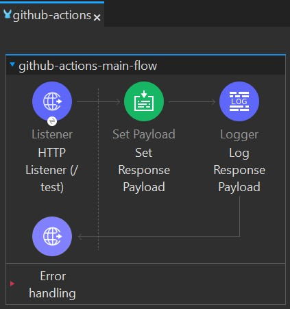
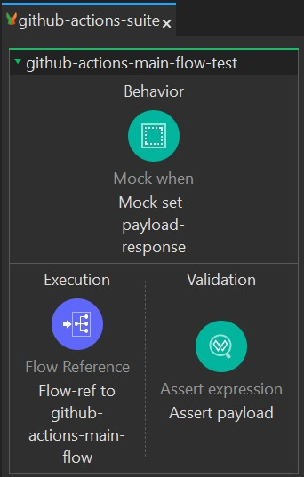

<!--
  Gerado com auxílio de:
    ✅ Profile README Generator (https://lnkd.in/d4TzMWbt)
    ✅ Readme.so (https://readme.so/pt)
    ✅ GPRM (https://gprm.itsvg.in)
    ✅ Profilinator (https://lnkd.in/dPijesji)
    ✅ GitHub Profile README Generator (https://lnkd.in/dYZCeX-D)
    ✅ Make a README (https://lnkd.in/dMG38TcF)
    ✅ Readme Typing SVG (https://lnkd.in/dMjHQMRy)
    ✅ Capsule Render (https://lnkd.in/d3EirSir)
    ✅ Metrics GitHub (https://metrics.lecoq.io)
    ✅ README Badges (https://shields.io)
-->

<h1 align="center">☁️ MuleSoft Application - GitHub Actions Deployment 🚀</h1>

<!-- Banner animado do Capsule Render -->
<p align="center">
  
</p>

<!-- Badges do Shields.io -->
<p align="center">
  <a href="https://docs.mulesoft.com/mule-runtime/4.6">
    
  </a>
  <a href="https://adoptium.net/">
    
  </a>
  <a href="https://maven.apache.org/">
    
  </a>
  <a href="https://docs.github.com/en/actions">
    
  </a>
  <a href="https://docs.mulesoft.com/munit/">
    
  </a>
</p>

<!-- Efeito de digitação (Readme Typing SVG) -->
<p align="center">
  
</p>

---

## Bem-vindo(a) ao repositório oficial do projeto **github-actions**! 
Este projeto demonstra como automatizar *builds* e *deploys* de uma aplicação **MuleSoft** no **CloudHub 2.0**, integrando **testes MUnit**, **cobertura de código** e um pipeline **GitHub Actions** para CI/CD.

---

## 🚀 Sumário
1. [Descrição Geral](#-descrição-geral)  
2. [Arquitetura e Fluxo Principal](#%EF%B8%8F-arquitetura-e-fluxo-principal)  
   - [Exemplo de Fluxo Principal](#exemplo-de-fluxo-principal)
   - [Ilustração do Fluxo Principal](#ilustração-do-fluxo-principal)
3. [Pré-Requisitos](#-pré-requisitos)  
4. [Estrutura do Projeto](#-estrutura-do-projeto)  
5. [Como Executar Localmente](#-como-executar-localmente)  
6. [Testes Automatizados (MUnit)](#-testes-automatizados-munit)  
   - [Ilustração do Fluxo de Testes MUnit](#ilustração-do-fluxo-de-testes-munit)
7. [Pipeline GitHub Actions](#-pipeline-github-actions)  
8. [Deploy no CloudHub 2.0](#-deploy-no-cloudhub-20)  
9. [Configuração de Logs (Log4j2)](#-configuração-de-logs-log4j2)  
10. [Contato](#-contato)  
11. [Referências Oficiais](#-referências-oficiais)  
12. [Conecte-se Comigo](#-conecte-se-comigo)

---

## 📄 Descrição Geral
Este repositório contém uma aplicação **Mule 4** que expõe um endpoint HTTP simples, executa testes com **MUnit** e utiliza um pipeline **GitHub Actions** para publicar artefatos no **Anypoint Exchange** e realizar deploy **automático** no **CloudHub 2.0**.

> **Importante**:  
> - Em **`dev`**, o projeto utiliza:  
>   - `<releaseChannel>LTS</releaseChannel>`  
>   - `<app.runtime>4.6.14</app.runtime>`  
>   - `<java.version>8</java.version>`  
> - Nos **demais ambientes** (Ex.: `qa`, `prod`), utiliza:  
>   - `<releaseChannel>EDGE</releaseChannel>`  
>   - `<app.runtime>4.9.2</app.runtime>`  
>   - `<java.version>17</java.version>`  

**Destaques**:
- **Runtime Mule**: 4.6.14 / 4.9.2 (ajustado no `settings.xml` conforme ambiente)
- **Estratégia de Deploy**: Rolling Update  
- **Object Store V2**: Habilitado em CloudHub 2.0  
- **Logs**: Configurados com [Log4j2](log4j2.xml)

---

## 🏗️ Arquitetura e Fluxo Principal
A aplicação expõe um **HTTP Listener** na rota `/test`. Quando acessado, retorna:
```
It worked!
```
E registra logs para acompanhamento.

### Exemplo de Fluxo Principal
```xml
<flow name="github-actions-main-flow">
    <http:listener path="/test" config-ref="http-listener-config"/>
    <set-payload value="It worked!"/>
    <logger message="#[payload]" level="INFO"/>
</flow>
```

#### Ilustração do Fluxo Principal
<p align="center">
  
</p>

---

## 📋 Pré-Requisitos
- **Anypoint Studio 7.x** (ou Maven instalado para rodar via CLI)
- **Java 8** (Zulu/OpenJDK) — em **dev**, mas pode ser **Java 17** nos demais ambientes  
- **Mule Runtime**: preferencialmente **4.6.14** em `dev` (LTS), **4.9.2** nos demais ambientes (EDGE)  
- **Conta no Anypoint Platform** com permissões em **Exchange** e **Runtime Manager** (caso vá fazer deploy)

---

## 📂 Estrutura do Projeto

```
├── src
│   ├── main
│   │   ├── mule
│   │   │   └── github-actions.xml       (Fluxo principal MuleSoft)
│   │   └── resources
│   │       ├── log4j2.xml              (Config. de logging)
│   │       ├── mule-artifact.json      (Metadados da aplicação)
│   │       └── application-types.xml   (Tipos customizados)
│   └── test
│       ├── munit
│       │   └── github-actions-suite.xml (Testes MUnit)
│       └── resources
│           └── ... (Mocks, asserts, etc.)
├── pom.xml                  (Build Maven, Plugins, Deploy CloudHub 2.0)
├── build.yml                (Workflow do GitHub Actions)
├── settings.xml             (Config. Maven p/ Anypoint Exchange - perfis dev/prod/qa/sandbox)
├── README.md                (Este documento)
└── ...
```

---

## 💻 Como Executar Localmente

1. **Clonar o repositório**:
   ```bash
   git clone https://github.com/seu-usuario/github-actions.git
   cd github-actions
   ```

2. **Abrir no Anypoint Studio**:  
   - Vá em **File → Import → Anypoint Studio Project from File System**  
   - Selecione a pasta do projeto clonado

3. **Executar via Anypoint Studio**:  
   - Clique com o botão direito no projeto → **Run As → Mule Application**  
   - A aplicação subirá na porta `8081`

4. **Testar o endpoint**:
   ```bash
   curl http://localhost:8081/test
   ```
   Deve retornar:
   ```
   It worked!
   ```

---

## 🧪 Testes Automatizados (MUnit)
- Os **testes MUnit** estão configurados no arquivo [`github-actions-suite.xml`](https://github.com/LeonelIntegrationXpert/github-actions/blob/main/src/test/munit/github-actions-suite.xml).  
- Para executar via linha de comando:
  ```bash
  mvn clean test
  ```
- Ao final, é gerado um relatório de cobertura em:
  ```
  target/munit-reports/
  ```

#### Ilustração do Fluxo de Testes MUnit
<p align="center">
  
</p>

> **Observação**: Caso apareça:
> ```
> [INFO] Run of munit-maven-plugin skipped. Property [skipMunitTests] was set to true
> ```
> Significa que a pipeline ou o comando Maven está usando `-DskipMunitTests=true`.  
> **Remova** essa flag para rodar os testes.

---

## 🔧 Pipeline GitHub Actions
No arquivo [`build.yml`](https://github.com/LeonelIntegrationXpert/github-actions/blob/main/.github/workflows/build.yml), temos um **workflow** que:
1. **Faz checkout** do repositório  
2. **Cacheia** dependências Maven  
3. **Configura** JDK 8  
4. **Publica** a aplicação no Exchange (`mvn deploy`)  
5. **Faz o deploy** no CloudHub 2.0  
   - Usa as variáveis (`secrets.CONNECTED_APP_CLIENT_ID` e `secrets.CONNECTED_APP_CLIENT_SECRET`) para autenticar

⚙️ **Disparo Automático**: a cada **push** no branch `main` (ou dev/qa/prod, conforme configurado).

---

## 🚢 Deploy no CloudHub 2.0
O [`pom.xml`](pom.xml) está configurado para realizar deploy no **CloudHub 2.0**. Principais pontos:

- `<muleVersion>4.6.14</muleVersion>` (em dev, canal **LTS**), mas pode ser `4.9.2` (EDGE) em outros perfis  
- `<replicas>1</replicas>` e `<vCores>0.1</vCores>`: tamanho e número de réplicas básicos  
- `<objectStoreV2>` habilitado em `<integrations><services>`  
- `<updateStrategy>rolling</updateStrategy>`: atualização sem downtime

**Exemplo** de comando para forçar o deploy localmente:
```bash
mvn clean deploy -DmuleDeploy \
  -Dclient.id=<CONNECTED_APP_CLIENT_ID> \
  -Dclient.secret=<CONNECTED_APP_CLIENT_SECRET>
```

> **Observação**:  
> - Se desejar clusterizar (`<deploymentSettings><clustered>enabled</clustered>`), lembre-se de ajustar `<replicas>` para `>= 2`.  
> - O `<releaseChannel>` e `<app.runtime>` podem ser sobrescritos via perfis no `settings.xml`.

---

## 📋 Configuração de Logs (Log4j2)
O arquivo [`log4j2.xml`](https://github.com/LeonelIntegrationXpert/github-actions/blob/main/src/main/resources/log4j2.xml) traz uma configuração **profissional** de logs:

- **Console Appender**: imprime logs no console do Anypoint Studio/CloudHub  
- **Rolling File Appender**: gera arquivos com rotação baseada em tamanho e data  
- **Log Pattern**: inclui data, nível, ID de correlação e caminho do processador  
- **AsyncLogger**: melhora a performance de gravação de logs

Exemplo de formato:
```
2025-03-16 10:00:00.123 [INFO ] [main] [processor: /testFlow/1] [event: 1234abcd-... ] - Mensagem de log
```

---

## 💬 Contato
Para dúvidas, suporte ou sugestões, entre em contato com:

- **Leonel Dorneles Porto**  
  - Email: [leoneldornelesporto@outlook.com.br](mailto:leoneldornelesporto@outlook.com.br)  
  - Telefone: **+55 53 99180-4869**

---

## 📚 Referências Oficiais
- [Documentação MuleSoft 4.4](https://docs.mulesoft.com/mule-runtime/4.4/)  
- [Deploy no CloudHub 2.0](https://docs.mulesoft.com/runtime-manager/deploying-to-cloudhub-2)  
- [MUnit (Testes e Cobertura)](https://docs.mulesoft.com/munit/)  
- [Log4j2 (Manual Oficial)](https://logging.apache.org/log4j/2.x/manual/)  
- [Integração com GitHub Actions](https://docs.github.com/en/actions)

---

## 🙌 Conecte-se comigo!

<p align="center">

  <!-- 📧 Email -->
  <a href="mailto:leoneldornelesporto@outlook.com.br">
    
  </a>

  <!-- 💼 LinkedIn -->
  <a href="https://www.linkedin.com/in/leonel-dorneles-porto-b88600122" target="_blank">
    
  </a>

  <!-- 🐙 GitHub Followers -->
  <a href="https://github.com/LeonelIntegrationXpert?tab=followers" target="_blank">
    
  </a>

  <!-- ☎️ Telefone / WhatsApp -->
  <a href="tel:+5553991804869">
    
  </a>

  <!-- 🎖️ Trailblazer -->
  <a href="https://www.salesforce.com/trailblazer/leonelporto" target="_blank">
    
  </a>

</p>

---

<!-- ✍️ Mensagem animada (Typing Effect) -->
<p align="center">
  
</p>

---

<!-- 🌊 Rodapé animado com onda -->
<p align="center">
  
</p>
